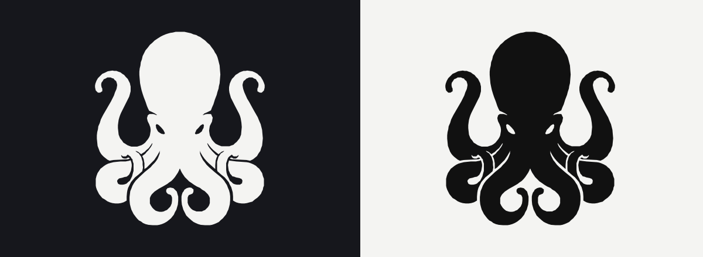

<div align="center">

# Octopus



Hot corners for your whole screen. Hover the cursor in any of 8 zones — Octopus fires your action.

</div>

## Features

- **8 trigger zones** — four corners plus top, bottom, left-middle, and right-middle edges
- **Open anything** — drop an app, file, folder, or script onto a zone in Settings and it launches when the zone triggers
- **7 system actions** — Mission Control, Apps, Show Desktop, Start Screen Saver, Lock Screen, Put Display to Sleep, and Control Center
- **Dwell trigger** — optional dwell delay (off by default); with dwell off, actions fire instantly on cursor entry
- **Ghosting** — configurable re-trigger cooldown per zone, so an action doesn't repeat while the cursor rests in a zone
- **Trigger effect** — visual feedback when a zone fires: Dwell Glow pulses at the corner, Edge Flash sweeps along the edge; size scales 50–200%
- **Trigger sound** — optional built-in macOS sound played together with the effect; pick *None* to keep visuals silent
- **Multi-monitor** — zones cover every connected display
- **Menu bar only** — no Dock icon; optional launch at login
- **Vector icon** — the octopus is a true SVG, rendered crisply at every size

## Assigning an action

Open **Settings** from the Octopus menu bar icon, then drag any app, file, folder, or script onto one of the eight zones. Prefer a built-in action? Pick one from the system-actions dropdown in the same editor.

## Requirements

- Apple Silicon (M1 or later) — Intel Macs are not supported
- macOS Tahoe (26) or later
- Accessibility permission: System Settings → Privacy & Security → Accessibility (Octopus asks on first launch)

## Build

```
xcodegen generate
xcodebuild -project Octopus.xcodeproj -scheme Octopus -configuration Release build
```
